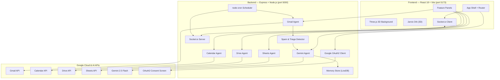
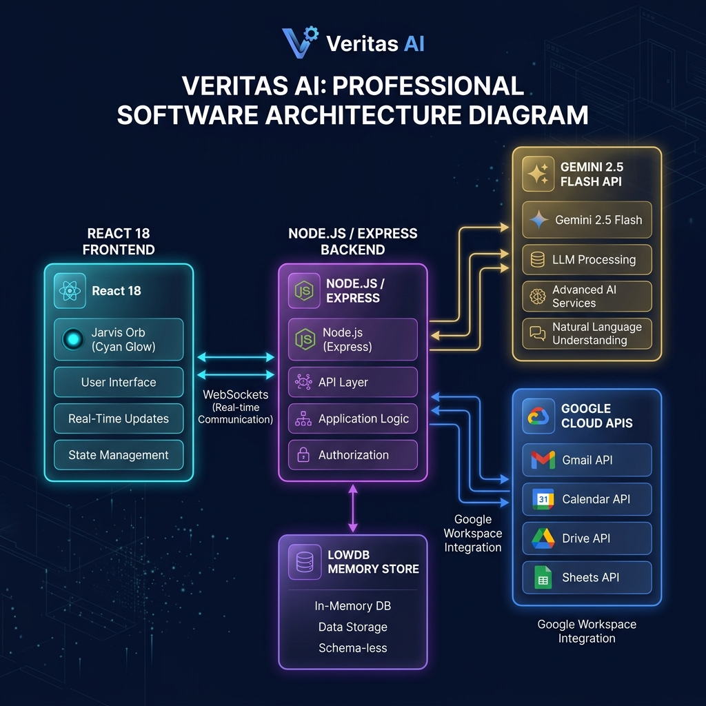
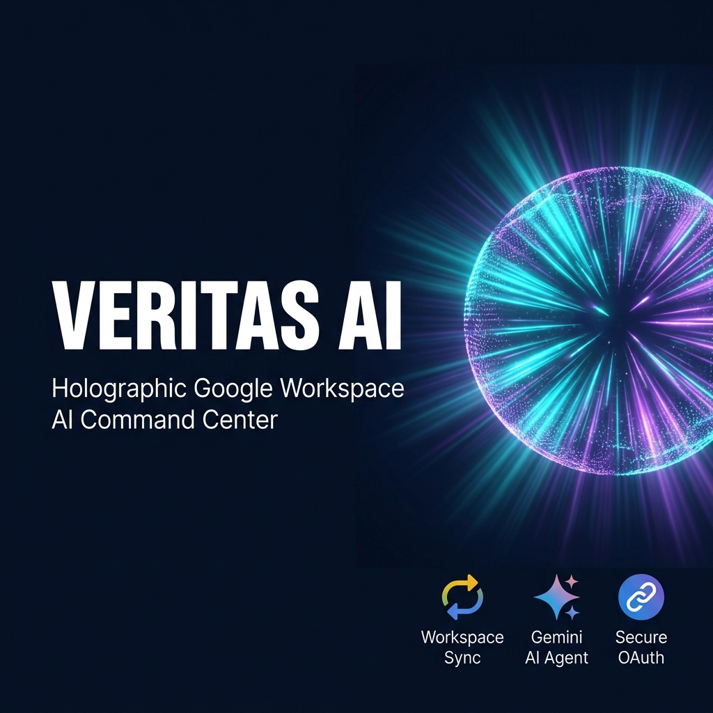

# Veritas AI — Personal Google Workspace AI Command Center

Veritas AI is a secure, high-performance personal AI command center that integrates directly with Google Workspace (Gmail, Calendar, Drive, Sheets) and Google News to provide an intelligent, unified dashboard and conversational controller.

Styled with premium cyberpunk glassmorphism aesthetics, it features an autonomous conversational agent (using Gemini 2.5 Flash), interactive custom SVG charts, a global search bar running parallel async API queries, and a Web Speech API voice interface.

---

## 🛠️ Architecture & Tech Stack



---

## 🔑 Prerequisites

- **Node.js**: v18.0.0 or higher
- **NPM**: v9.0.0 or higher
- **Gemini API Key**: Get one from [Google AI Studio](https://aistudio.google.com/apikey)
- **Google Cloud Console Project**:
  - Enable Gmail, Google Calendar, Google Drive, Google Sheets, and People APIs.
  - Set up an OAuth Consent Screen (Internal or External with your email added as a test user).
  - Create OAuth 2.0 Credentials (Web Application) with the Redirect URI set to: `http://localhost:5000/oauth2callback`

---

## 🚀 Quick Start

1. **Clone the repository**:
   ```bash
   git clone <repo-url>
   cd Google_personal_assistant
   ```

2. **Install all dependencies**:
   ```bash
   npm run install:all
   ```

3. **Configure the backend environment**:
   Create a `.env` file inside the `backend/` directory with the following variables:
   ```env
   PORT=5000
   GEMINI_API_KEY=your_gemini_api_key
   
   # Google OAuth Credentials
   GOOGLE_CLIENT_ID=your_google_client_id.apps.googleusercontent.com
   GOOGLE_CLIENT_SECRET=your_google_client_secret
   GOOGLE_REDIRECT_URI=http://localhost:5000/oauth2callback
   
   # Google Sheets Logging Config
   GOOGLE_SHEET_ID=your_google_spreadsheet_id
   GOOGLE_SHEET_NAME=your_sheet_tab_name (e.g., Sheet1)
   
   # Express Session Encryption
   SESSION_SECRET=your_random_string_secret
   ```

4. **Run in development mode**:
   ```bash
   npm run dev
   ```
   - The backend runs at `http://localhost:5000`
   - The frontend runs at `http://localhost:5173` (Vite automatically proxies `/api` and `/auth` routes to port 5000)

---

## 🧪 Sample Test Cases

### 1. OAuth Authentication & Interface Load
- **Input**: Open browser to `http://localhost:5173` and click "Connect with Google".
- **Expected Flow**:
  - Redirected to Google's consent screen.
  - Log in and grant permissions.
  - Redirected back to backend callback (`/oauth2callback`), which stores the auth tokens and session.
  - Frontend loads the main dashboard HUD with Three.js grid lines, background stars, pulsing Jarvis Orb, and live clock.

### 2. Smart Email Classification & Drafting
- **Input**: Navigate to the Gmail tab.
- **Expected Flow**:
  - Workspace Gmails load and are categorized into color-coded tabs: `ALL`, `JOB`, `REAL`, `SPAM`, `PROMO`.
  - Click on an email -> select **Draft Reply with AI** -> Choose tone (*Professional* or *Witty*).
  - The Gemini agent parses the email context, drafts a high-quality response, and displays it in the editable textbox.

### 3. Voice Command Scheduling
- **Input**: Open the Chat Panel, click the Mic icon, and say: `"Schedule a product launch meeting tomorrow at 3pm."`
- **Expected Flow**:
  - Voice transcription appears live in the chat input.
  - When you stop speaking, the transcription is sent.
  - Gemini parses the intent, calls the Google Calendar API to insert the event, and displays a success badge: `[✅ Event Created]`.

---

## ⚠️ Troubleshooting

1. **Error: `listen EADDRINUSE: address already in use :::5000`**
   - *Cause*: A lingering node process is already listening on port 5000.
   - *Fix*: Run the cleanup command:
     - *Windows (PowerShell)*:
       ```powershell
       Get-Process -Id (Get-NetTCPConnection -LocalPort 5000, 5173 -ErrorAction SilentlyContinue).OwningProcess | Stop-Process -Force
       ```
     - *macOS/Linux*:
       ```bash
       lsof -ti:5000,5173 | xargs kill -9
       ```

2. **Google OAuth Error: `redirect_uri_mismatch`**
   - *Cause*: The Redirect URI in the Google Cloud Console does not match `GOOGLE_REDIRECT_URI` in `backend/.env`.
   - *Fix*: Update both to `http://localhost:5000/oauth2callback`.

3. **Gemini API fails with `400/403` or Rate Limit Errors**
   - *Cause*: Invalid API key or free-tier quota exhaustion (15 RPM limit).
   - *Fix*: Check your `backend/.env` file. To avoid rate limits, Veritas AI has Layer 1 (regex/whitelist) and Layer 2 (keyword) classification rules to process emails first, calling Gemini only for ambiguous items.

---

## 🖼️ Assets

- **Solution Architecture**: 
- **Cover Banner**: 

---

## 📑 Demo Script

A conversational 3-minute demo video script is available in [DEMO_SCRIPT.txt](file:///d:/vide%20coding/Google_personal_assistant/DEMO_SCRIPT.txt).

---

## Push to GitHub

1. Create a new repository at https://github.com/new
   - Name: `veritas-ai`
   - Visibility: Public or Private
   - Do NOT initialize with README (you already have one)

2. In your terminal, navigate into your project folder:
   ```bash
   cd Google_personal_assistant
   git init
   git add .
   git commit -m "Initial commit: Veritas AI Assistant"
   git branch -M main
   git remote add origin https://github.com/<your-username>/veritas-ai.git
   git push -u origin main
   ```

3. Verify `.gitignore` includes:
   - `node_modules/`
   - `backend/.env` (your client secrets — must NEVER be pushed)
   - `backend/memory/*.json` (active session tokens)
   - `dist/`

⚠️ **NEVER push credentials or `.env` files to GitHub.**
