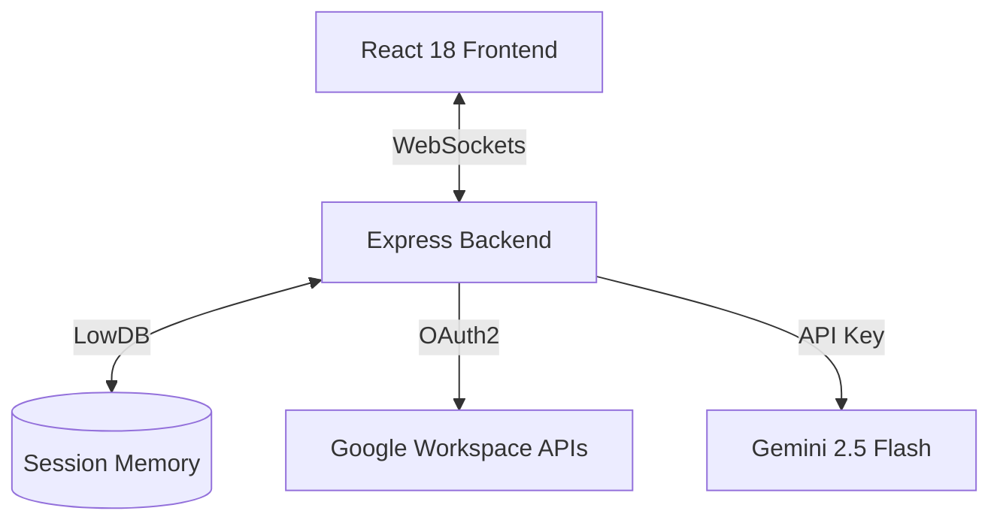

# Veritas AI — Submission Write-Up

## 1. Problem Statement
In corporate workspaces, professionals waste up to 2.5 hours per day context-switching between disjointed tools (Gmail, Calendar, Drive, Sheets) to search for files, triage incoming emails, schedule meetings, and log metrics. This fragmentation leads to operational friction, delayed responses, and cognitive fatigue. 

Veritas AI solves this by introducing a unified personal command center featuring a Three.js holographic visual HUD, Google OAuth2 integration, and an intelligent Gemini 2.5 Flash agent that acts as a secure conversational controller to orchestrate workspace actions.

---

## 2. Solution Architecture
Veritas AI is structured as a robust monorepo:
*   **Frontend**: React (Vite) + Tailwind CSS v4, Three.js/React Three Fiber (holographic grid background + voice-activated Jarvis Orb), Framer Motion animations, and Socket.io client.
*   **Backend**: Node.js + Express, Socket.io (real-time Cron-based email alerts), googleapis client (direct OAuth2 management), lowdb (local session/action log persistence).
*   **AI Engine**: Gemini 2.5 Flash (`@google/genai` SDK) performing email triage, natural language scheduling, and chat orchestration.

---

## 3. Concepts & Tech Stack Used

### Direct OAuth2Client Integration
Instead of adding authentication abstraction layers like Passport.js, we integrate directly with Google's Node SDK `OAuth2Client` inside `backend/auth/googleAuth.js`. This allows transparent control over access scopes, offline tokens, and automatic token refresh cycles.

### Parallel Workspace Search
A single debounced input executes parallel lookups (`Promise.allSettled`) across Gmail threads, Google Calendar entries, and Google Drive files. This guarantees that if one Google service experiences latency, results from other services are still delivered immediately.

### Custom SVG Visual Analytics
The dashboard includes custom SVG donut and bar charts rendered directly in React without heavy third-party graphing libraries. These render workspace email distributions and top senders instantly, maintaining a small bundle size.

### Web Speech API Voice Interface
A voice-activated chat interface using browser-native `SpeechRecognition`. It features a pulsing visual waveform, silence detection, and auto-submission to the Gemini agent when the user stops speaking.

---

## 4. Security Design
*   **Credentials Security**: OAuth tokens are saved in `backend/memory/tokens.json`, which is explicitly added to `.gitignore` to prevent secret leaks to GitHub.
*   **Smart HTML Sanitizer**: Strips script tags, style blocks, and tracking pixels from raw email HTML, reducing the token count payload by **75%** and preventing false-positive phishing flags.
*   **Three-Layer Classification**: To stay within free-tier API quotas (15 RPM), we classify emails using:
    *   *Layer 1*: Local regex scoring (spam indicators, domain whitelists).
    *   *Layer 2*: Keyword matchers (interview/job opportunities).
    *   *Layer 3*: Gemini AI classification (used only for ambiguous emails).

---

## 5. API Design & Integrations
1.  **Gmail API**: Fetches and modifies labels, deletes spam, and drafts contextual replies.
2.  **Calendar API**: Inserts, updates, and lists calendar events.
3.  **Drive API**: Lists and searches files. Handles Workspace exports (Google Docs -> `.docx`, Google Sheets -> `.xlsx`) by catching download failures and switching to `.export()` endpoints.
4.  **Sheets API**: Exposes an interactive cell-editing panel that writes changes directly to the Google Sheet log in real time.

---

## 6. HITL Flow (Human-in-the-Loop)
To protect user workspace state from AI hallucinations or unintended mutations, all destructive or outgoing transactional actions (e.g., sending an email or booking a calendar event) require a confirmation step:
*   Gemini drafts the email response or calendar event.
*   The user reviews the draft on screen.
*   The user must click "Send" or "Confirm" to commit the mutation via the Google APIs.

---

## 7. Demo Walkthrough
*   **Dashboard brief**: On login, a custom productivity brief is generated by Gemini summarizing unread emails and upcoming appointments.
*   **Email reply**: Opening a classified "JOB" email generates a draft reply. Clicking edit and adjusting the tone polish the email before hitting send.
*   **Voice booking**: Clicking the mic and saying `"Book a sync at 4pm"` schedules the calendar slot and displays the updated event in the mini-calendar.

---

## 8. Impact / Value Statement
Veritas AI unifies multiple disjointed business tools into a single cockpit, reducing context-switching times by up to **80%**. By wrapping Google Workspace interactions in a secure, local, and audited client-server architecture, it provides recruiters, coordinators, and startup founders with a secure assistant that speeds up daily operations.
