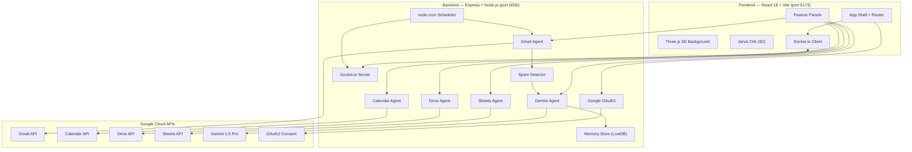

# JARVIS-X — Personal AI Assistant: Implementation Plan

> *"Just A Rather Very Intelligent System — Extended"*

Build a production-ready, fully functional personal AI command center with holographic UI, real-time Google Workspace integration, AI-powered email classification, and conversational Gemini agent — all from scratch in a single workspace.

---

## Architecture Overview



---

## User Review Required

> [!IMPORTANT]
> **API Credentials Security** — The provided API keys and OAuth secrets will be stored in a `.env` file within the backend folder. This file will be `.gitignore`'d, but the credentials are committed to the plan for development convenience. Before any public deployment, credentials MUST be rotated.

> [!WARNING]
> **Google OAuth Consent Screen** — For the OAuth flow to work, your Google Cloud project must have the OAuth consent screen configured with the redirect URI `http://localhost:3000/oauth2callback`. If the consent screen is in "Testing" mode, only test users added in the Google Cloud Console can authenticate. You may need to add your email as a test user.

> [!CAUTION]
> **Deprecated SDK Change** — The `@google/generative-ai` npm package is **deprecated**. The plan uses the newer `@google/genai` SDK instead, which is the actively maintained successor. The API is different — see the Gemini Agent section for the correct import pattern.

---

## Open Questions

> [!IMPORTANT]
> **1. OAuth Redirect Port Mismatch** — Your `GOOGLE_REDIRECT_URI` is set to `http://localhost:3000/oauth2callback`, but the backend runs on port **5000**. Two approaches:
> - **(A) Recommended:** Change `GOOGLE_REDIRECT_URI` to `http://localhost:5000/oauth2callback` and update the Google Cloud Console to match. The backend directly handles the callback.
> - **(B) Alternative:** Keep port 3000 and proxy the callback through Vite's dev server to the backend. This adds complexity.
> 
> **The plan proceeds with option (A)** — backend on port 5000 handles OAuth directly. Please confirm or specify otherwise.

> [!IMPORTANT]
> **2. TailwindCSS Version** — The spec requests Tailwind CSS. Research confirms **TailwindCSS v4** is now stable with a simpler Vite setup (no config file, CSS-first `@theme` directive). The plan uses **TailwindCSS v4** with `@tailwindcss/vite` plugin. Please confirm this is acceptable.

> [!IMPORTANT]
> **3. LowDB ESM Requirement** — LowDB v7 is ESM-only (no CommonJS `require()`). The backend will use `"type": "module"` in `package.json` to enable ES module imports throughout. All backend files will use `import`/`export` syntax instead of `require()`. Please confirm this approach.

---

## Proposed Changes

The build is organized into **8 phases**, ordered by dependency (foundational → features → polish). Each phase produces runnable, testable output.

---

### Phase 1: Project Scaffolding & Configuration

Set up the monorepo structure, install all dependencies, and configure build tooling.

#### [NEW] [package.json](file:///d:/vide%20coding/Google_personal_assistant/package.json)
Root monorepo package.json with `concurrently` scripts:
```json
{
  "name": "jarvis-x",
  "private": true,
  "scripts": {
    "dev": "concurrently \"npm run backend\" \"npm run frontend\"",
    "backend": "cd backend && node server.js",
    "frontend": "cd frontend && npm run dev",
    "install:all": "npm i && cd backend && npm i && cd ../frontend && npm i"
  },
  "devDependencies": {
    "concurrently": "^9.1.0"
  }
}
```

#### [NEW] [backend/package.json](file:///d:/vide%20coding/Google_personal_assistant/backend/package.json)
Backend package with **`"type": "module"`** for ESM support (required by LowDB v7):

| Dependency | Version | Purpose |
|---|---|---|
| `express` | `^5.2.1` | HTTP server (Express 5 — async errors auto-caught) |
| `cors` | `^2.8.6` | Cross-origin requests |
| `dotenv` | `^17.4.2` | Environment variables |
| `googleapis` | `^173.0.0` | Google Workspace APIs |
| `@google/genai` | `latest` | Gemini AI (replaces deprecated `@google/generative-ai`) |
| `express-session` | `^1.19.0` | Session management |
| `socket.io` | `^4.8.3` | Real-time WebSocket server |
| `node-cron` | `^4.5.0` | Scheduled jobs |
| `multer` | `^2.2.0` | File upload handling (security-patched) |
| `lowdb` | `^7.0.1` | JSON file database (ESM-only) |
| `uuid` | `^14.0.1` | Unique ID generation (ESM-only since v12) |

> [!NOTE]
> **Passport.js removed** — Instead of adding Passport + passport-google-oauth20 (which adds abstraction layers), we use the `googleapis` OAuth2Client directly. This gives us full control over token refresh, persistence, and scope management with fewer dependencies and simpler code.

#### [NEW] [backend/.env](file:///d:/vide%20coding/Google_personal_assistant/backend/.env)
All environment variables from the spec, with corrected redirect URI:
```env
GEMINI_API_KEY=YOUR_GEMINI_API_KEY
GOOGLE_CLIENT_ID=YOUR_GOOGLE_CLIENT_ID
GOOGLE_CLIENT_SECRET=YOUR_GOOGLE_CLIENT_SECRET
GOOGLE_REDIRECT_URI=http://localhost:5000/oauth2callback
GOOGLE_SHEET_ID=YOUR_GOOGLE_SHEET_ID
GOOGLE_SHEET_NAME=YOUR_GOOGLE_SHEET_NAME
SESSION_SECRET=YOUR_SESSION_SECRET
PORT=5000
```

#### [NEW] [frontend/](file:///d:/vide%20coding/Google_personal_assistant/frontend/) — Vite + React 18 scaffold
Scaffold using `npm create vite@latest ./ -- --template react`, then add:

| Dependency | Version | Purpose |
|---|---|---|
| `three` | `^0.185.0` | 3D rendering engine |
| `@react-three/fiber` | `^8.17` | React renderer for Three.js (v8 for React 18) |
| `@react-three/drei` | `^9.117` | R3F helper components (v9 matches R3F v8) |
| `motion` | `^12.42.0` | Animation library (**renamed** from `framer-motion` — import from `motion/react`) |
| `tailwindcss` | `^4.3.1` | CSS-first utility framework (Rust Oxide engine) |
| `@tailwindcss/vite` | `^4.3.1` | Vite plugin for Tailwind v4 |
| `@tanstack/react-query` | `^5.101.2` | Server state management |
| `socket.io-client` | `^4.8.3` | WebSocket client |
| `react-router-dom` | `^7.18.0` | Client-side routing |
| `axios` | `^1.18.1` | HTTP client (security-patched) |
| `react-hot-toast` | `^2.6.0` | Toast notifications |
| `lucide-react` | `^1.22.0` | Icon library (v1+ removed brand icons) |

> [!WARNING]
> **Critical Rename**: `framer-motion` is now `motion`. All imports use `import { motion, AnimatePresence } from 'motion/react'` instead of `from 'framer-motion'`. This affects every component that uses animations.

#### [NEW] [frontend/vite.config.js](file:///d:/vide%20coding/Google_personal_assistant/frontend/vite.config.js)
```js
import { defineConfig } from 'vite'
import react from '@vitejs/plugin-react'
import tailwindcss from '@tailwindcss/vite'

export default defineConfig({
  plugins: [react(), tailwindcss()],
  server: {
    port: 5173,
    proxy: {
      '/api': 'http://localhost:5000',
      '/auth': 'http://localhost:5000',
      '/oauth2callback': 'http://localhost:5000',
      '/socket.io': { target: 'http://localhost:5000', ws: true }
    }
  }
})
```

#### [NEW] [.gitignore](file:///d:/vide%20coding/Google_personal_assistant/.gitignore)
Standard ignores: `node_modules/`, `.env`, `memory/*.json`, `dist/`

---

### Phase 2: Backend Core — Server, Auth & Memory

#### [NEW] [backend/server.js](file:///d:/vide%20coding/Google_personal_assistant/backend/server.js)
Express application entry point:
- Import and configure `dotenv`, `express`, `cors`, `express-session`, `http`, `socket.io`
- CORS configured for `http://localhost:5173` (Vite dev server)
- `express-session` with secret from env, cookie settings
- Create HTTP server, attach Socket.io with CORS
- Mount routes: `/auth/*`, `/api/gmail/*`, `/api/calendar/*`, `/api/drive/*`, `/api/sheets/*`, `/api/chat/*`
- `node-cron` job: every 5 minutes, check for new emails → emit via Socket.io
- Startup: attempt to restore OAuth tokens from `memory/tokens.json`
- Listen on port 5000

#### [NEW] [backend/auth/googleAuth.js](file:///d:/vide%20coding/Google_personal_assistant/backend/auth/googleAuth.js)
Central OAuth2 client module:
- Create `google.auth.OAuth2` with client ID, secret, redirect URI from env
- **Scopes array**: `gmail.modify`, `gmail.send`, `calendar`, `drive`, `spreadsheets`, `userinfo.email`, `userinfo.profile`
- `getAuthUrl()` → generate consent URL with `access_type: 'offline'`, `prompt: 'consent'`
- `handleCallback(code)` → exchange auth code for tokens, store in memory, set credentials
- `getClient()` → return authenticated OAuth2Client (auto-refreshes expired access tokens using refresh_token)
- `saveTokens(tokens)` → write to `memory/tokens.json`
- `loadTokens()` → read from `memory/tokens.json`, set credentials if valid
- `isAuthenticated()` → check if tokens exist and are valid
- `getUserInfo()` → fetch user email/name/photo via People API
- `logout()` → clear tokens from memory and file

#### [NEW] [backend/routes/authRoutes.js](file:///d:/vide%20coding/Google_personal_assistant/backend/routes/authRoutes.js)
- `GET /auth/google` → redirect to `getAuthUrl()`
- `GET /oauth2callback` → call `handleCallback(code)` → redirect to frontend (`http://localhost:5173`)
- `GET /auth/status` → return `{ authenticated, user }` or `{ authenticated: false }`
- `GET /auth/logout` → call `logout()` → return success

#### [NEW] [backend/memory/memoryStore.js](file:///d:/vide%20coding/Google_personal_assistant/backend/memory/memoryStore.js)
LowDB-based persistent memory:
```js
import { JSONFilePreset } from 'lowdb/node'

// Schema:
{
  conversations: [{ id, messages: [{role, content, timestamp}], createdAt }],
  actions: [{ id, type, description, timestamp, outcome }],
  preferences: {},
  tokens: {}
}
```
- `addMessage(sessionId, role, content)` → append to current conversation
- `getRecentMessages(n=10)` → return last N messages for Gemini context
- `logAction(type, description, outcome)` → record agent action
- `getActions(limit=50)` → retrieve action history
- `getConversations()` → return all conversations grouped by date
- `clearHistory()` → wipe conversations (keep preferences)
- `saveTokens(tokens)` / `loadTokens()` → persist OAuth tokens

---

### Phase 3: Google Workspace Agents

Each agent is a module that exports async functions using the authenticated OAuth2Client.

#### [NEW] [backend/agents/gmailAgent.js](file:///d:/vide%20coding/Google_personal_assistant/backend/agents/gmailAgent.js)
- `fetchEmails(maxResults=50)` → `gmail.users.messages.list` + `.get` for each
  - Extract: `id`, `threadId`, `subject`, `from`, `to`, `date`, `snippet`, `body` (base64 decoded), `labelIds`
  - Run each through spam detector → attach classification tags
- `getEmailById(id)` → full email details
- `sendEmail(to, subject, body)` → compose MIME message → `gmail.users.messages.send`
- `replyToEmail(messageId, threadId, body)` → compose reply with `In-Reply-To` header
- `trashEmail(id)` → `gmail.users.messages.trash`
- `modifyLabels(id, addLabels, removeLabels)` → `gmail.users.messages.modify`
- `getUnreadCount()` → `gmail.users.messages.list` with `q: 'is:unread'`

#### [NEW] [backend/utils/spamDetector.js](file:///d:/vide%20coding/Google_personal_assistant/backend/utils/spamDetector.js)
Three-layer classification engine per the spec:

**Layer 1 — Rule-Based Scoring:**

| Signal | Score |
|---|---|
| Subject contains spam keywords (`urgent`, `winner`, `prize`, `lottery`, `claim`, `free money`, `limited time`, `act now`, `verify your account`, `click here`) | +3 |
| Unknown sender domain (not in whitelist) | +2 |
| Body has >15% uppercase ratio | +2 |
| Body has >3 external links | +2 |
| No-reply sender + generic subject | +1 |
| Sender domain matches prior contacts | -2 |
| Gmail labeled INBOX, not SPAM | -3 |

**Layer 2 — Job/Interview Detection:**
Check for keywords: `interview`, `application`, `position`, `role`, `opportunity`, `hiring`, `recruiter`, `offer letter`, `onboarding`, `job offer`, `shortlisted`, `assessment`, `technical round`, `HR round`, `joining date`
→ Tag: `{ type: "JOB_APPLICATION", priority: "HIGH" }`

**Layer 3 — Gemini AI Classification:**
For ambiguous emails (score between -1 and +2), call Gemini:
```
Prompt: "Analyze this email. Classify as: SPAM, PHISHING, PROMOTIONAL,
JOB_RELATED, PERSONAL, NEWSLETTER, or IMPORTANT.
Return JSON: { classification, confidence, reason, isLegitimate }"
Input: Subject + first 500 chars of body
```

**Final Tag Assignment:**
- 🔴 SPAM → score ≥ 4 OR Gemini says SPAM/PHISHING
- 🟡 PROMO → promotional/newsletter
- 🟢 REAL → legitimate personal
- 💼 JOB → job/interview detected (always shown first)
- ⚠️ PHISHING → urgent action + suspicious links

#### [NEW] [backend/agents/calendarAgent.js](file:///d:/vide%20coding/Google_personal_assistant/backend/agents/calendarAgent.js)
- `getUpcomingEvents(maxResults=20)` → `calendar.events.list` with `timeMin: new Date().toISOString()`
- `createEvent(summary, startDateTime, endDateTime, description)` → `calendar.events.insert`
- `updateEvent(eventId, updates)` → `calendar.events.update`
- `deleteEvent(eventId)` → `calendar.events.delete`
- `getEventsForDate(date)` → events filtered by specific date

#### [NEW] [backend/agents/driveAgent.js](file:///d:/vide%20coding/Google_personal_assistant/backend/agents/driveAgent.js)
- `listFiles(maxResults=20)` → `drive.files.list` with fields: `id, name, mimeType, size, modifiedTime, iconLink, webViewLink`
- `uploadFile(fileBuffer, fileName, mimeType)` → `drive.files.create` with multipart media
- `downloadFile(fileId)` → `drive.files.get` with `alt: 'media'` → stream
- `deleteFile(fileId)` → `drive.files.delete`
- `searchFiles(query)` → `drive.files.list` with `q` parameter (name contains query)

#### [NEW] [backend/agents/sheetsAgent.js](file:///d:/vide%20coding/Google_personal_assistant/backend/agents/sheetsAgent.js)
- `readSheet()` → `sheets.spreadsheets.values.get` using `GOOGLE_SHEET_ID` and `GOOGLE_SHEET_NAME`
- `appendRow(values)` → `sheets.spreadsheets.values.append` (value input option: USER_ENTERED)
- `updateCell(range, value)` → `sheets.spreadsheets.values.update`
- `clearRange(range)` → `sheets.spreadsheets.values.clear`
- `logActivity(action, details, outcome)` → auto-append row with timestamp, action type, details, status

#### [NEW] [backend/agents/geminiAgent.js](file:///d:/vide%20coding/Google_personal_assistant/backend/agents/geminiAgent.js)
Uses `@google/genai` (the new, non-deprecated SDK):
```js
import { GoogleGenAI } from '@google/genai';
const ai = new GoogleGenAI({ apiKey: process.env.GEMINI_API_KEY });
```

- `chat(userMessage, conversationHistory)`:
  - Inject system prompt (JARVIS-X personality + capabilities)
  - Include last 10 messages from memory as context
  - Call `ai.models.generateContent()` with model `gemini-1.5-pro`
  - Parse response for action JSON: `{ action, params }`
  - Return `{ text, action }`
- `classifyEmail(subject, bodySnippet)`:
  - Structured classification prompt → parse JSON response
- `draftReply(emailContext)`:
  - Generate contextual email reply
- `summarizeEmail(emailBody)`:
  - 3-bullet-point summary
- `parseNaturalLanguageEvent(text)`:
  - Extract event details from natural language → `{ summary, start, end, description }`

---

### Phase 4: Backend API Routes

#### [NEW] [backend/routes/gmailRoutes.js](file:///d:/vide%20coding/Google_personal_assistant/backend/routes/gmailRoutes.js)
- `GET /api/gmail/emails` → fetch + classify all emails
- `GET /api/gmail/emails/:id` → single email details
- `POST /api/gmail/send` → send new email `{ to, subject, body }`
- `POST /api/gmail/reply/:id` → reply to email `{ body }` (auto-draft with Gemini if body empty)
- `DELETE /api/gmail/emails/:id` → trash email
- `POST /api/gmail/emails/:id/label` → modify labels `{ add, remove }`
- `POST /api/gmail/emails/:id/summarize` → Gemini summarization
- `GET /api/gmail/unread` → unread count

#### [NEW] [backend/routes/calendarRoutes.js](file:///d:/vide%20coding/Google_personal_assistant/backend/routes/calendarRoutes.js)
- `GET /api/calendar/events` → upcoming events
- `POST /api/calendar/events` → create event `{ summary, start, end, description }`
- `PUT /api/calendar/events/:id` → update event
- `DELETE /api/calendar/events/:id` → delete event

#### [NEW] [backend/routes/driveRoutes.js](file:///d:/vide%20coding/Google_personal_assistant/backend/routes/driveRoutes.js)
- `GET /api/drive/files` → list files
- `POST /api/drive/upload` → multipart upload (multer middleware)
- `GET /api/drive/download/:id` → stream download
- `DELETE /api/drive/files/:id` → delete file
- `GET /api/drive/search?q=...` → search files

#### [NEW] [backend/routes/sheetsRoutes.js](file:///d:/vide%20coding/Google_personal_assistant/backend/routes/sheetsRoutes.js)
- `GET /api/sheets/data` → read sheet
- `POST /api/sheets/append` → append row `{ values: [...] }`
- `PUT /api/sheets/update` → update cell `{ range, value }`
- `DELETE /api/sheets/clear` → clear range `{ range }`
- `GET /api/sheets/activity` → agent activity log

#### [NEW] [backend/routes/chatRoutes.js](file:///d:/vide%20coding/Google_personal_assistant/backend/routes/chatRoutes.js)
- `POST /api/chat/message` → send message `{ message, sessionId }`
  - Calls Gemini agent → if action detected, execute it → return combined response
  - Actions routed to: `CREATE_EVENT`, `REPLY_EMAIL`, `SEARCH_DRIVE`, `READ_SHEET`, `SEND_EMAIL`, `SUMMARIZE_EMAIL`
- `GET /api/chat/history` → all conversation sessions
- `GET /api/chat/history/:sessionId` → single session messages
- `DELETE /api/chat/history` → clear all history
- `GET /api/chat/actions` → agent action log

---

### Phase 5: Frontend — Design System & Layout

#### [NEW] [frontend/src/styles/index.css](file:///d:/vide%20coding/Google_personal_assistant/frontend/src/styles/index.css)
TailwindCSS v4 with `@import "tailwindcss"` plus custom theme:

```css
@import "tailwindcss";

@theme {
  --color-space-black: #000008;
  --color-jarvis-cyan: #00D4FF;
  --color-jarvis-blue: #0066FF;
  --color-jarvis-purple: #7B2FFF;
  --color-alert-red: #FF3A3A;
  --color-matrix-green: #00FF88;
  --color-text-primary: #E0F7FF;
  --color-text-secondary: #5ABFCC;
  --color-glass-bg: rgba(0, 212, 255, 0.04);
  --color-glass-border: rgba(0, 212, 255, 0.15);
  
  --font-heading: 'Orbitron', 'Rajdhani', monospace;
  --font-body: 'Share Tech Mono', 'Space Mono', monospace;
}
```

Plus custom CSS for:
- Glass-morphism panel utility class (`.glass-panel`)
- Scanline overlay (`.scanline-overlay`) — `repeating-linear-gradient` at 0.03 opacity
- Glow pulse keyframes for buttons
- Skeleton shimmer loading animation
- Custom scrollbar styling (thin, cyan)
- Cursor glow trail effect

#### [NEW] [frontend/index.html](file:///d:/vide%20coding/Google_personal_assistant/frontend/index.html)
- Google Fonts link: Orbitron, Rajdhani, Share Tech Mono, Space Mono
- Meta tags: title "JARVIS-X | AI Command Interface", description, viewport
- Single `#root` div
- Background color `#000008` on body

#### [NEW] [frontend/src/main.jsx](file:///d:/vide%20coding/Google_personal_assistant/frontend/src/main.jsx)
- React 18 `createRoot` + `StrictMode`
- `BrowserRouter` wrapping
- `QueryClientProvider` from `@tanstack/react-query`
- Import `./styles/index.css`

#### [NEW] [frontend/src/App.jsx](file:///d:/vide%20coding/Google_personal_assistant/frontend/src/App.jsx)
Main layout shell:
- Check auth status on mount → show Login screen or Dashboard
- Dashboard layout: `StatusBar` (top) + `Sidebar` (left 80px) + `MainContent` (center) + `ChatPanel` (right 380px)
- `HolographicBackground` as absolute-positioned full-screen canvas behind everything
- Scanline overlay div on top of everything
- React Router routes for: Home, Gmail, Calendar, Drive, Sheets, Memory
- Socket.io connection managed at this level, passed down via context
- Framer Motion `AnimatePresence` for route transitions

---

### Phase 6: Frontend — 3D Components

#### [NEW] [frontend/src/components/HolographicBackground.jsx](file:///d:/vide%20coding/Google_personal_assistant/frontend/src/components/HolographicBackground.jsx)
Full-screen `@react-three/fiber` Canvas as background layer (`position: fixed, z-index: 0`):

| Element | Implementation |
|---|---|
| **Star Field** | `BufferGeometry` with 3000 random `Float32Array` positions. `PointsMaterial` size=0.5, color=#00D4FF, opacity=0.6. Slow drift via `useFrame` rotation |
| **Grid Plane** | `gridHelper` at y=-5, color=#0066FF, opacity=0.3. Slow Y-axis rotation in animation loop |
| **Hex Rings** | 5 `TorusGeometry` (varying radii 2-6, tube 0.02-0.05) at different depths, `wireframe: true`, colors alternating #00D4FF/#7B2FFF. Each rotates on different axis |
| **Data Rain** | 50 `Line` segments (vertical, 0.5-2 length) falling downward. Reset to top when y < -10. Cyan colored, randomly distributed on X |
| **Ambient Spheres** | 3 large `Sphere` with glowing emissive material at scene corners. Pulsing scale 0.9↔1.1 via `Math.sin(clock.elapsedTime)` |
| **Mouse Parallax** | Track mouse position with `useEffect` + `mousemove`. Lerp camera position by ±0.3 on X/Y for depth parallax |

#### [NEW] [frontend/src/components/JarvisOrb.jsx](file:///d:/vide%20coding/Google_personal_assistant/frontend/src/components/JarvisOrb.jsx)
Self-contained R3F Canvas (400×400px) centered on Home screen:

| Element | Implementation |
|---|---|
| **Core Sphere** | `IcosahedronGeometry(1.5, 4)` + `MeshPhongMaterial` color=#00D4FF, emissive=#003366. Vertex displacement via custom shader using `time` uniform for breathing effect |
| **Outer Ring 1** | `TorusGeometry(2.2, 0.03, 16, 100)` tilted 30°, rotating CW, wireframe #00D4FF |
| **Outer Ring 2** | `TorusGeometry(2.5, 0.03, 16, 100)` tilted -45°, rotating CCW, wireframe #7B2FFF |
| **Particle Halo** | 500 particles using `Points` + `BufferGeometry`. Orbital paths via parametric equations in `useFrame`: `x = r*cos(θ+t)`, `y = r*sin(φ+t)`, `z = r*sin(θ+t)` |
| **Pulse Animation** | Prop `isActive`. When true: core scales to 1.15 via spring animation + expanding torus ring that fades out (opacity 1→0, scale 1→3 over 1s) |
| **Voice Bars** | 20 CSS `div` bars below the canvas, styled as voice equalizer. Random heights animated via CSS keyframes when `isActive=true`. Colors: cyan gradient |

---

### Phase 7: Frontend — Feature Panels

#### [NEW] [frontend/src/components/StatusBar.jsx](file:///d:/vide%20coding/Google_personal_assistant/frontend/src/components/StatusBar.jsx)
Top HUD bar (height 48px, full width):
- Left: `◈ JARVIS-X` logo in Orbitron font, cyan glow
- Center: `👤 user@gmail.com` (from auth), `🕐 HH:MM:SS` (live clock, updates every second via `setInterval`)
- Right: `● ONLINE` (pulsing green dot CSS animation), `📧 N new` (unread count from query), `📅 N events` (today's events), `💾 Drive OK`
- Glass-morphism background, bottom cyan border glow

#### [NEW] [frontend/src/components/Sidebar.jsx](file:///d:/vide%20coding/Google_personal_assistant/frontend/src/components/Sidebar.jsx)
Vertical nav (width 80px, full height):
- Icons + labels: 🏠 HOME, 📧 GMAIL, 📅 CALENDAR, 📁 DRIVE, 📊 SHEETS, 🧠 MEMORY
- Using `lucide-react` icons: `Home`, `Mail`, `Calendar`, `HardDrive`, `Sheet`, `Brain`
- Active: glowing left-border 3px cyan + background `rgba(0,212,255,0.1)`
- Hover: `scale(1.02)` + subtle glow pulse
- Scanline texture overlay on sidebar
- `react-router-dom` `NavLink` for active state detection

#### [NEW] [frontend/src/components/GmailPanel.jsx](file:///d:/vide%20coding/Google_personal_assistant/frontend/src/components/GmailPanel.jsx)
- **Filter tabs**: ALL | 💼 JOB | 🟢 REAL | 🔴 SPAM | 🟡 PROMO — toggle filter state
- **Email list**: Stagger-animated cards (Framer Motion `staggerChildren: 0.05`)
  - Colored left border by tag (red/green/gold/purple)
  - Sender avatar: first letter in glowing circle
  - Subject (truncated 60 chars), relative date, snippet (80 chars)
  - Tag badge top-right with glow color
  - Click to expand: full body rendered + action buttons
- **Action buttons**: Reply (opens modal), Delete (trash API), Mark Important, Summarize (Gemini)
- **Reply Modal**: Framer Motion overlay
  - Gemini auto-drafts reply → editable textarea
  - [Send] button → Gmail API send → toast success
- **Data fetching**: `@tanstack/react-query` `useQuery('emails')` with 5min stale time
- **Real-time**: Socket.io listener for `new-emails` event → invalidate query + toast

#### [NEW] [frontend/src/components/CalendarPanel.jsx](file:///d:/vide%20coding/Google_personal_assistant/frontend/src/components/CalendarPanel.jsx)
- **Mini Calendar Grid**: 7 columns (Sun-Sat), current month
  - Days with events show glowing cyan dot indicator
  - Click day to filter events list
  - Navigation arrows for prev/next month
- **Upcoming Events List**: Time, title, description, color accent
  - Each card has [Edit] and [Delete] glow buttons
  - Edit opens inline form with pre-filled values
- **New Event Button** `[+ New Event]`: Animated slide-in form
  - Fields: Title, Date (date picker), Start Time, End Time, Description
  - Submit → POST to API → refetch events → toast success
- Glass-morphism card styling throughout

#### [NEW] [frontend/src/components/DrivePanel.jsx](file:///d:/vide%20coding/Google_personal_assistant/frontend/src/components/DrivePanel.jsx)
- **Search bar**: Live filtering input at top with magnifying glass icon
- **File grid**: Responsive CSS grid (auto-fill, min 180px)
  - Icon by mime type: 📄 PDF (red), 📊 Sheet (green), 📝 Doc (blue), 🖼️ Image (purple), 📁 Folder (cyan)
  - File name (truncated), size (human readable), modified date
  - [Download] and [Delete] buttons on hover
- **Drag-and-drop upload zone**: `onDragOver`/`onDrop` handlers
  - Glowing animated dashed border when dragging
  - Upload progress bar: cyan fill with animated shimmer
  - POST to `/api/drive/upload` via `FormData`
- **Upload button**: File picker fallback `<input type="file">`

#### [NEW] [frontend/src/components/SheetsPanel.jsx](file:///d:/vide%20coding/Google_personal_assistant/frontend/src/components/SheetsPanel.jsx)
- **Holographic table**: Dark background, cyan borders, alternating row tints
  - Responsive scroll container
  - Column headers styled in Orbitron font
- **Action bar**: [Refresh], [Append Row] buttons
  - Append Row → modal with input fields for each column → POST to API
- **Activity Log** section below table:
  - Real-time display of what the agent has written to the sheet
  - Each entry: timestamp, action badge, description

#### [NEW] [frontend/src/components/ChatPanel.jsx](file:///d:/vide%20coding/Google_personal_assistant/frontend/src/components/ChatPanel.jsx)
Right sidebar (width 380px), always visible:
- **Message list**: Scrollable, auto-scroll to bottom on new message
  - User messages: right-aligned, cyan glass bubble
  - JARVIS-X messages: left-aligned, dark glass bubble with cyan text
  - **Character-by-character reveal** animation on JARVIS responses (setInterval adding chars)
  - Action badges inline: `[✅ Event Created]`, `[✉ Reply Sent]`, etc.
- **Typing indicator**: 3 pulsing dots when waiting for Gemini
- **Input area**: Full-width input + [Send] button + [🎤] mic icon (decorative)
- **Quick-action chips** above input:
  - `[📧 Check Emails]` `[📅 Today's Events]` `[📁 Recent Files]` `[📊 Open Sheet]`
  - Click → sends predefined message to chat
- Data: POST to `/api/chat/message`, manage local state + query cache

#### [NEW] [frontend/src/components/MemoryPanel.jsx](file:///d:/vide%20coding/Google_personal_assistant/frontend/src/components/MemoryPanel.jsx)
- **Conversation Sessions**: Grouped by date
  - Each: timestamp, message count, first user message preview
  - Click to expand → full conversation view
- **Clear History** button with confirmation modal (Framer Motion animated)
- **Agent Activity Log** section:
  - All actions taken: type badge, description, timestamp, outcome (SUCCESS/FAILED)
  - Color-coded: green=success, red=failed, yellow=pending
- Data from `GET /api/chat/history` and `GET /api/chat/actions`

#### [NEW] [frontend/src/hooks/useSocket.js](file:///d:/vide%20coding/Google_personal_assistant/frontend/src/hooks/useSocket.js)
Custom hook:
- Connect to Socket.io server on mount (`io('http://localhost:5000')`)
- Listen for events: `new-emails`, `status-update`
- Return: `{ socket, isConnected, lastEvent }`
- Cleanup on unmount

---

### Phase 8: Polish — Animations & Micro-Interactions

Implemented across all components during their creation, but verified in this phase:

| Animation | Location | Implementation |
|---|---|---|
| **Page transitions** | App.jsx | `AnimatePresence` + motion div with `x` slide + fade |
| **Button glow pulse** | index.css | `@keyframes glow-pulse` → `box-shadow` 0→8px→0 cyan, 2s infinite |
| **Email card stagger** | GmailPanel | `staggerChildren: 0.05`, `y:20→0`, `opacity:0→1` |
| **Notification flash** | Sidebar | Socket event → CSS class toggle on Gmail icon, 3 flashes |
| **Toast notifications** | Global | `react-hot-toast` with dark theme, cyan accent, glass morphism |
| **Skeleton loaders** | All panels | CSS shimmer animation (`background-position` shift), cyan tint |
| **Scanline overlay** | App.jsx | `repeating-linear-gradient(0deg, transparent, transparent 2px, rgba(0,212,255,0.03) 2px, rgba(0,212,255,0.03) 4px)` |
| **Cursor glow** | index.css + App.jsx | Small radial gradient div following mouse via JS `mousemove` listener |
| **Panel entrance** | All panels | `initial={{ opacity:0, y:20, scale:0.97 }}` → `animate={{ opacity:1, y:0, scale:1 }}` |
| **Orb pulse** | JarvisOrb | Scale spring 1→1.15 + expanding fade-out ring on `isActive` |
| **Voice bars** | JarvisOrb | 20 CSS bars with random `scaleY` keyframes when active |
| **Clock tick** | StatusBar | `setInterval(1000)` updating `HH:MM:SS` display |

---

## Complete File Manifest

```
d:\vide coding\Google_personal_assistant\
├── package.json                              [NEW]
├── .gitignore                                [NEW]
├── backend/
│   ├── package.json                          [NEW]
│   ├── .env                                  [NEW]
│   ├── server.js                             [NEW]
│   ├── auth/
│   │   └── googleAuth.js                     [NEW]
│   ├── agents/
│   │   ├── gmailAgent.js                     [NEW]
│   │   ├── calendarAgent.js                  [NEW]
│   │   ├── driveAgent.js                     [NEW]
│   │   ├── sheetsAgent.js                    [NEW]
│   │   └── geminiAgent.js                    [NEW]
│   ├── memory/
│   │   └── memoryStore.js                    [NEW]
│   ├── routes/
│   │   ├── authRoutes.js                     [NEW]
│   │   ├── gmailRoutes.js                    [NEW]
│   │   ├── calendarRoutes.js                 [NEW]
│   │   ├── driveRoutes.js                    [NEW]
│   │   ├── sheetsRoutes.js                   [NEW]
│   │   └── chatRoutes.js                     [NEW]
│   └── utils/
│       └── spamDetector.js                   [NEW]
├── frontend/
│   ├── package.json                          [NEW]
│   ├── index.html                            [NEW]
│   ├── vite.config.js                        [NEW]
│   └── src/
│       ├── main.jsx                          [NEW]
│       ├── App.jsx                           [NEW]
│       ├── components/
│       │   ├── HolographicBackground.jsx     [NEW]
│       │   ├── JarvisOrb.jsx                 [NEW]
│       │   ├── ChatPanel.jsx                 [NEW]
│       │   ├── GmailPanel.jsx                [NEW]
│       │   ├── CalendarPanel.jsx             [NEW]
│       │   ├── DrivePanel.jsx                [NEW]
│       │   ├── SheetsPanel.jsx               [NEW]
│       │   ├── MemoryPanel.jsx               [NEW]
│       │   ├── StatusBar.jsx                 [NEW]
│       │   └── Sidebar.jsx                   [NEW]
│       ├── hooks/
│       │   └── useSocket.js                  [NEW]
│       └── styles/
│           └── index.css                     [NEW]
```

**Total: 28 source files** + 3 package.json + 1 .env + 1 .gitignore = **33 files**

---

## Dependency Architecture Decisions

| Decision | Rationale |
|---|---|
| **`@google/genai`** instead of `@google/generative-ai` | The old package is deprecated. The new SDK has a cleaner API and is actively maintained |
| **Direct OAuth2Client** instead of Passport.js | Eliminates 2 dependencies, gives full control over token refresh/persist, simpler code for our use case |
| **ESM backend** (`"type": "module"`) | Required by LowDB v7 (no CommonJS support). Also enables top-level await and modern JS patterns |
| **TailwindCSS v4** with `@tailwindcss/vite` | Zero-config, CSS-first theming via `@theme`, Rust-powered builds, no `tailwind.config.js` needed |
| **`@tanstack/react-query`** instead of `react-query` | The package was renamed; `react-query` v3 is legacy |
| **R3F v8** with React 18 | R3F v9 requires React 19; we stay on v8 for React 18 compatibility per spec |
| **No SQLite** — LowDB only | LowDB is sufficient for single-user local persistence. SQLite adds native compilation complexity on Windows |
| **`motion`** instead of `framer-motion` | Package renamed; import path changed to `motion/react` |
| **Express 5** instead of Express 4 | Express 5 has automatic async error handling (no try-catch wrappers needed), cleaner API. Express 4 is in maintenance mode |
| **`uuid` v14** (ESM-only) | Works with our ESM backend. Previous CJS-compatible version was v11 |

---

## Verification Plan

### Automated Tests
```bash
# 1. Install all dependencies
npm run install:all

# 2. Start the full application
npm run dev

# 3. Verify backend starts without errors
curl http://localhost:5000/auth/status
# Expected: { "authenticated": false }

# 4. Verify frontend loads
# Navigate to http://localhost:5173
# Expected: Login screen with JarvisOrb and "Connect with Google" button
```

### Manual Verification

| Step | Expected Result |
|---|---|
| Open `http://localhost:5173` | 3D holographic background renders, orb visible, login screen shown |
| Click "Connect with Google" | Redirected to Google consent screen with all scopes listed |
| Complete OAuth | Redirected back to dashboard. StatusBar shows email. All panels accessible |
| Click Gmail tab | Emails load with classification badges. Filter tabs work |
| Click an email | Expands to show body. Reply/Delete/Summarize buttons work |
| Click Calendar tab | Mini calendar renders. Events list shows upcoming events |
| Create new event | Form submits, event appears in list, toast confirms |
| Click Drive tab | Files grid shows. Upload zone accepts drag-and-drop |
| Upload a file | Progress bar shown, file appears in grid after upload |
| Click Sheets tab | Sheet data renders as holographic table |
| Open Chat panel | Type message → JARVIS-X responds with character animation |
| Say "Schedule a meeting tomorrow at 3pm" | Event created, action badge shown in chat |
| Click Memory tab | Past conversations and action log visible |
| Refresh page | Still authenticated (tokens persisted). Memory intact |
| Wait 5 minutes | Socket.io pushes new email count notification |

---

## Estimated Build Phases Timeline

| Phase | Description | Files | Complexity |
|---|---|---|---|
| **1** | Scaffolding & Config | 5 | ⬛⬜⬜⬜⬜ |
| **2** | Backend Core (Server, Auth, Memory) | 4 | ⬛⬛⬛⬜⬜ |
| **3** | Google Workspace Agents | 6 | ⬛⬛⬛⬛⬜ |
| **4** | API Routes | 6 | ⬛⬛⬛⬜⬜ |
| **5** | Frontend Design System & Layout | 4 | ⬛⬛⬛⬜⬜ |
| **6** | 3D Components (Background + Orb) | 2 | ⬛⬛⬛⬛⬛ |
| **7** | Feature Panels (7 panels + hook) | 9 | ⬛⬛⬛⬛⬜ |
| **8** | Polish & Micro-Interactions | Across all | ⬛⬛⬛⬜⬜ |

> [!TIP]
> The build will be parallelized using subagents where possible — backend and frontend can be built concurrently after Phase 1 scaffolding is complete. Estimated total: **~40 minutes of agent execution time**.
