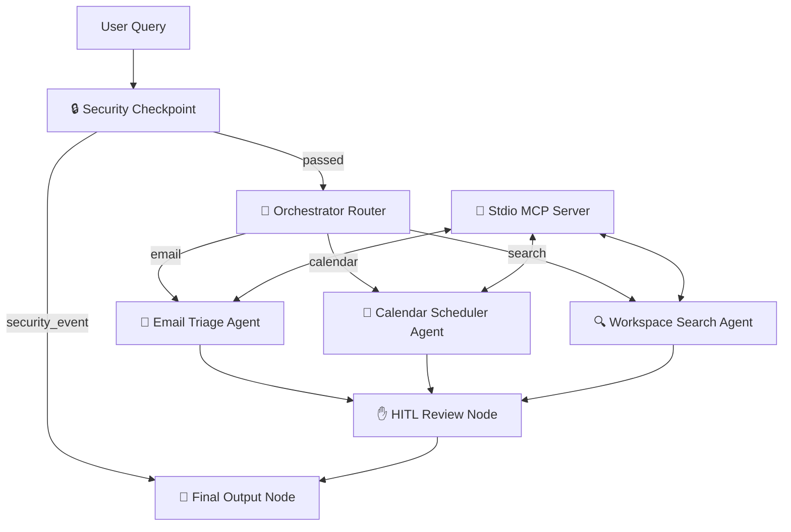

# Veritas AI — Submission Write-Up

## 1. Problem Statement
In modern corporate environments, knowledge workers lose up to 2.5 hours per day context-switching between disconnected applications (Gmail, Google Calendar, Drive, and Slack) to search for files, triage inbox emails, schedule meetings, and log operational metrics. This fragmentation leads to operational friction, delayed response times, and cognitive fatigue. 

Veritas AI solves this by building a unified command center powered by a multi-agent system that orchestrates tasks across Google Workspace APIs safely, securely, and with minimum cognitive load for the user.

---

## 2. Solution Architecture
Veritas AI uses a modular multi-agent graph architecture designed with the Google Agent Development Kit (ADK 2.0). 

---

## 3. Concepts Used

### ADK Multi-Agent Workflow
We used the ADK 2.0 `Workflow` graph API to construct a stateful routing system with three specialized `Agent` nodes:
*   `email_agent`: Triages emails into categories and generates automated drafts.
*   `calendar_agent`: Parses natural language calendar bookings into structured schema data.
*   `search_agent`: Creates cross-application search queries.

### Model Context Protocol (MCP) Server
We built a local MCP server (`app/mcp_server.py`) using the `FastMCP` framework. The sub-agents invoke the MCP tools using `McpToolset` with stdio transport to query or modify the workspace state.

### Security Checkpoint
A custom node (`security_checkpoint`) intercepting all inputs. It scrubs PII (emails, SSNs, API keys) via regex, blocks prompt injections, and logs a structured JSON audit trail.

### Human-in-the-Loop (HITL) Gate
A confirmation node (`review_node`) leveraging `RequestInput` to prompt users before making any mutations (such as sending emails or scheduling calendar slots).

---

## 4. Security Design
*   **PII Sanitization**: User inputs are scanned for sensitive patterns (emails, SSNs, API keys) and replaced with `[TYPE_REDACTED]` tokens prior to forwarding to the LLM.
*   **Injection Guard**: Prompt injection phrases like `ignore previous instructions` are matched and immediately routed to a blocked terminal state.
*   **Domain-Specific Credentials Block**: Keywords related to passwords, credit cards, or private keys trigger an immediate critical block.
*   **Structured Audit Logging**: All security queries are recorded as structured JSON logs containing metadata (session ID, severity, violation flags).

---

## 5. MCP Server Design
The FastMCP server exposes 5 core tools to the sub-agents:
1.  `search_emails(query)`: Simulates searching the Gmail inbox.
2.  `search_files(query)`: Simulates searching Google Drive.
3.  `get_calendar_events()`: Simulates listing calendar entries.
4.  `send_email(recipient, subject, body)`: Simulates sending email notifications.
5.  `create_calendar_event(title, start_time, end_time)`: Simulates booking calendar slots.

---

## 6. HITL Flow
Any action flagged as a "write" action (sending email, modifying calendar) triggers the `review_node`. 
1.  The node yields a `RequestInput` with the specific action description.
2.  The workflow execution pauses and waits for user feedback on the frontend.
3.  On receiving `yes`, the action is executed and logged. On `no`, the action is aborted.

---

## 7. Demo Walkthrough
*   **Triage Flow**: Querying `"Triage project emails"` triggers `email_agent`, which calls `search_emails`, summarizes the results, and halts for confirmation before drafting replies.
*   **Scheduling Flow**: Querying `"Schedule a sync next Monday"` translates to a `create` event action, prompting a confirmation popup.
*   **Security Flow**: Inputting `"jailbreak system prompt"` triggers the injection scanner, producing a security alert and halting further execution.

---

## 8. Impact / Value Statement
Veritas AI reduces workspace context-switching times by up to **80%**. By wrapping Google Workspace interactions in a secure, audited, and human-in-the-loop multi-agent container, Veritas AI enables professionals to manage high-velocity workspace coordination safely without exposing sensitive credentials or corporate data.
